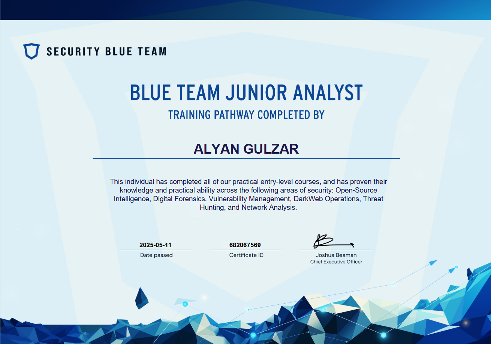

<h1 align="center">Hi 👋, I'm Alyan Gulzar</h1>
<h3 align="center">A Passionate Cybersecurity Enthusiast and Scripting Ninja 🛡️💻</h3>

  

- 🔭 I’m currently working on [Mobile Forensics Application](https://github.com/AlyanGulzar/Mobile-Forensics-Application-)

- 🌱 I’m currently learning **RUST and GO**

- 📝 I regularly write articles on [https://medium.com/@alyangulzar149](https://medium.com/@alyangulzar149)

- 📫 How to reach me **alyangulzar149@gmail.com**

###

  
  

###
---

## Certifications:

    
    
    
    
    
---

<h3 align="left">Connect with me:</h3>

  
  
  

<h3 align="left">Languages and Tools:</h3>

       

###
